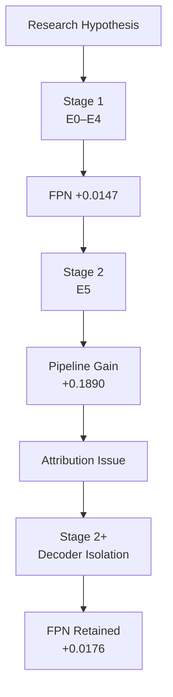
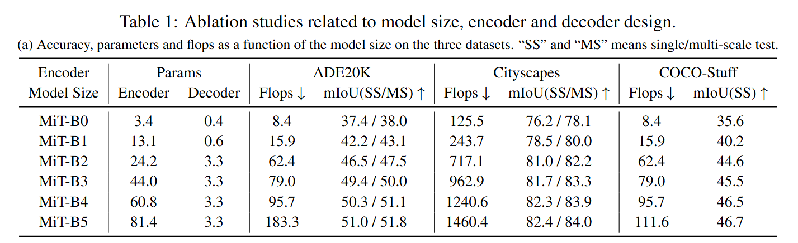
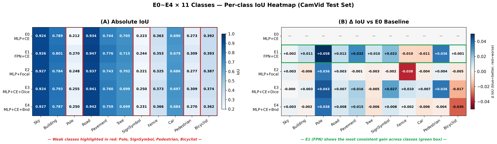
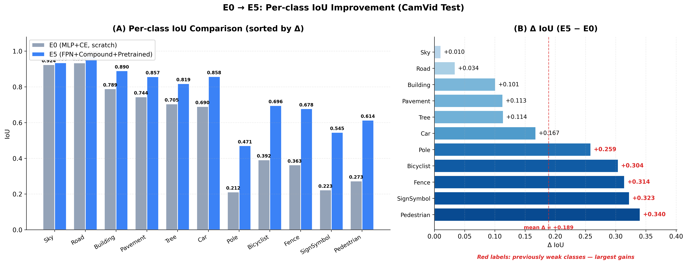
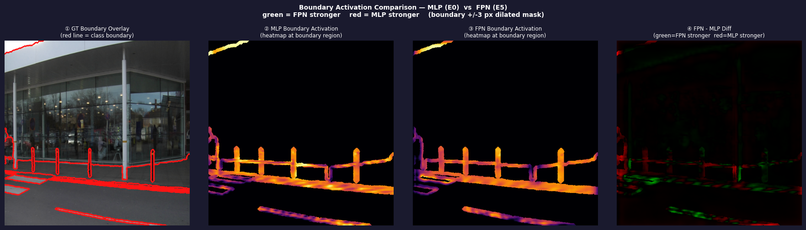
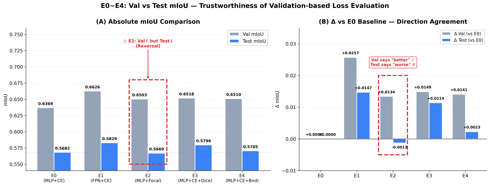
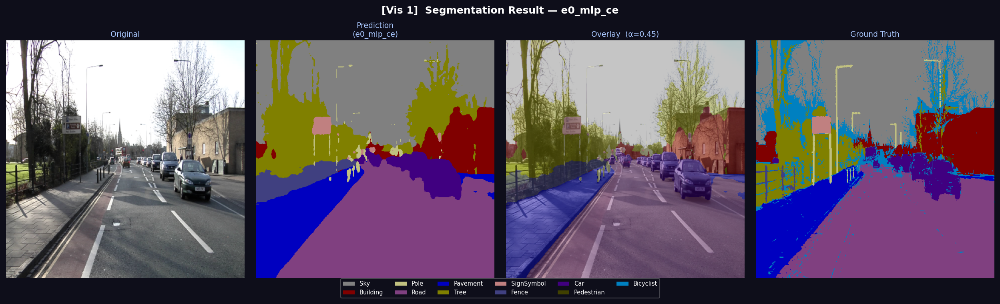
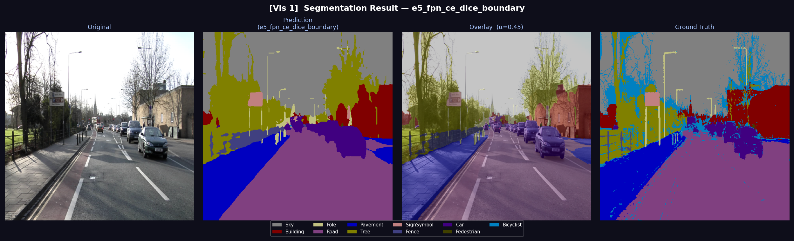

# SegFormer-B0 Semantic Segmentation Research Project

**Decoder 구조 변경은 lightweight encoder의 한계를 완화할 수 있는가?**
>
> 본 프로젝트는 SegFormer-B0에서 decoder 구조(FPN)의 실제 기여를  
> **controlled experiment**와 **decoder isolation** 기반으로 분석한 연구 프로젝트입니다.

---

## Experimental Flow



---

## 1. Overview

본 프로젝트는 SegFormer-B0를 기반으로,
lightweight encoder 환경에서 decoder 구조 변경이 segmentation 성능에 미치는 영향을 분석한 연구입니다.

저희 연구는 SegFormer 논문의 model size ablation에서 출발했습니다.

SegFormer는 동일한 lightweight All-MLP decoder를 사용하면서도  
MiT-B0부터 MiT-B5까지 encoder scale에 따라 mIoU 차이가 크게 발생합니다.

<p align="center">
  
</p>

> **Reference from SegFormer paper**  
> MiT encoder scale에 따라 segmentation 성능 차이 발생

이 결과에서 다음 문제의식을 설정했습니다.

> **encoder capacity가 제한된 SegFormer-B0에서는  
> decoder 단계의 multi-scale feature fusion이 더 중요한 역할을 할 수 있다.**

Reference :

- **SegFormer : Simple and Efficient Design for Semantic Segmentation with Transformers**
- https://arxiv.org/abs/2105.15203


---

## 2. Research Motivation

### SegFormer-B0 Limitation

- encoder scale에 따른 큰 mIoU 차이
- lightweight MLP decoder 구조
- 제한적인 multi-scale interaction
- small/thin object segmentation 약화 가능성

---

## 3. Research Goal

본 프로젝트의 목표는 다음 질문을 검증하는 것입니다.

| Goal | Question | Scope |
|---|---|---|
| G1 | Decoder 구조 변경(FPN)이 lightweight encoder의 한계를 완화할 수 있는가? | 본 repo |
| G2 | Loss function 조합이 segmentation 성능과 generalization에 어떤 영향을 주는가? | 본 repo |
| G3 | 제안한 pipeline이 medical segmentation domain에도 적용 가능한가? | 별도 repo |

현재 repo에서는 G1, G2를 중심으로 다룹니다.

G3는 Kvasir-SEG 기반 아래의 medical segmentation project에서 확인할 수 있습니다.

- https://github.com/iNES-Segmentation-Project/medical-seg-core

---

## 4. Experimental Design

### Core Principles

#### Encoder 고정

- MiT-B0 구조 유지
- encoder 기능 변경 금지
- general-purpose segmentation pipeline 검증 목적
- 실험 재사용성을 위한 encoder 모듈화만 수행
- 추가 연산 또는 구조적 변경 없음

#### Single-variable Principle

- E0~E4는 decoder 또는 loss 중 하나만 변경
- 동일 학습 조건 유지
- 변수별 영향 분리

#### Fair Comparison

- 동일 dataset
- 동일 epoch
- 동일 augmentation 조건
- 동일 metric 기준

#### E5 Combined Experiment

E0~E4 결과를 기반으로 성능 향상 가능성이 높은 요소를 조합했습니다.

- FPN decoder
- CE + Dice + Boundary loss
- pretrained encoder
- diff-LR
- augmentation

> diff-LR은 pretrained encoder와 새로 학습되는 decoder의 학습 속도를 분리하기 위한 설정입니다.
> encoder representation을 과도하게 깨뜨리지 않으면서 decoder 학습을 안정화하는 목적입니다.

---

## 5. Controlled Experiments

### Stage 1 — Single Variable Experiment

| Exp | Decoder | Loss | Changed Variable |
|---|---|---|---|
| E0 | MLP | CE | Baseline |
| E1 | FPN | CE | Decoder |
| E2 | MLP | Focal | Loss |
| E3 | MLP | CE + Dice | Loss |
| E4 | MLP | CE + Boundary | Loss |



> Stage 1의 E0–E4 단일 변수 실험 결과입니다.  
> E1(FPN)은 Pole, SignSymbol, Pedestrian 등 weak small/thin class에서 비교적 일관된 improvement를 보였습니다.  
> 반면 loss-based experiments(E2–E4)는 class-wise gain이 불안정하게 나타났습니다.  
> 이는 decoder 구조 변경이 loss 변경보다 안정적인 개선 패턴을 보였다는 초기 근거입니다.

<details>
<summary>Stage 1 Detailed Analysis</summary>

- E0: MLP + CE baseline
- E1: decoder만 FPN으로 변경
- E2–E4: decoder는 MLP로 고정하고 loss만 변경
- FPN decoder는 weak class 중심의 improvement를 보임
- loss 변경은 일부 class에서 gain과 drop이 함께 나타남
- Stage 1 결과는 Stage 2 combined experiment와 Stage 2+ decoder isolation 설계의 근거로 사용됨

</details>

---

## 6. Key Results



> E5 combined experiment에서 pipeline-level improvement 관찰  
> weak small/thin object class 중심 성능 향상 확인

| Exp | Main Change | Test mIoU | Δ |
|---|---|---:|---:|
| E0 | MLP + CE | 0.5682 | — |
| E1 | FPN Decoder | 0.5829 | +0.0147 |
| E2 | Focal Loss | 0.5669 | -0.0013 |
| E3 | CE + Dice | 0.5796 | +0.0114 |
| E4 | CE + Boundary | 0.5705 | +0.0023 |
| E5 | Combined Pipeline | 0.7572 | +0.1890 |
| Stage 2+ | Decoder Isolation | 0.7490 | +0.0176 |

> E5는 combined experiment이므로 FPN 단독 효과로 해석하지 않습니다.  
> FPN 효과는 Stage 1과 Stage 2+ isolation 결과를 기준으로 해석합니다.

---

## 7. Decoder Isolation (Stage 2+)

E5는 큰 성능 향상을 보였지만 여러 요소가 동시에 변경된 combined experiment입니다.

따라서 다음 질문이 남습니다.

**"E5의 성능 향상이 FPN 때문인가, pretrained 때문인가, augmentation 때문인가?"**

이를 보완하기 위해 Stage 2+에서는 decoder만 변경했습니다.

### Fixed Conditions

- pretrained encoder
- CE loss
- scheduler
- augmentation
- train/val/test split

| Setting | Decoder | Test mIoU | Δ |
|---|---|---:|---:|
| Baseline | MLP | 0.7314 | — |
| FPN | FPN | 0.7490 | +0.0176 |

| Condition | MLP → FPN Δ |
|---|---:|
| Scratch (E0 → E1) | +0.0147 |
| Pretrained (Stage 2+) | +0.0176 |

> training condition 변화와 무관하게 FPN improvement 재현  
> decoder 구조 자체의 기여 가능성 확인

<details>
<summary>Computational Cost</summary>

| Metric | MLP | FPN | Δ |
|---|---:|---:|---:|
| Params | 3.72M | 6.08M | +63.5% |
| GFLOPs | 7.91 | 20.77 | +162.6% |
| Latency | 12.4 ms | 16.2 ms | +30.9% |
| FPS | 80.95 | 61.85 | -23.6% |

FPN은 성능 향상을 보였지만 computational cost가 증가했습니다.

따라서 lightweight FPN variant는 후속 연구 과제로 남깁니다.

</details>

---

## 8. Qualitative Analysis



> thin/small object boundary 영역에서 stronger activation pattern 관찰  
> 정량 결과의 보조적 정성 근거

<details>
<summary>Validation/Test Discrepancy</summary>



> E2(Focal Loss)에서 validation/test discrepancy 관찰  
> validation score만으로 loss 효과를 판단하기 어려움

</details>

<details>
<summary>Qualitative Segmentation Comparison</summary>

### E0 Baseline



### E5 Combined Pipeline



> E5에서 small/thin object detail 개선 관찰  
> 단, combined experiment 결과이므로 FPN 단독 효과로 해석하지 않음

</details>

---

## 9. Implementation Highlights

- SegFormer encoder/decoder modularization
- FPN / MLP decoder 구현
- YAML 기반 experiment config 관리
- decoder isolation experiment 구조 구현
- HuggingFace pretrained weight remapping
- metric / visualization pipeline 구현

<details>
<summary>Implementation Details</summary>

### Encoder Modularization

- MiT-B0 구조 유지
- encoder 기능 변경 없음
- 실험 재사용성을 위한 모듈화
- decoder 교체 가능 구조 구성

### Decoder Implementation

MLP decoder

- feature projection
- upsampling
- concatenation
- fusion conv

FPN decoder

- lateral connection
- top-down pathway
- multi-scale feature fusion
- semantic propagation

### YAML Config Pipeline

- model type
- decoder type
- loss type
- pretrained 여부
- augmentation
- scheduler
- learning rate
- epoch

config 변경만으로 E0~E5 및 Stage 2+ 실험을 재현할 수 있도록 구성했습니다.

### Pretrained Weight Remapping

HuggingFace `mit-b0` weight를 custom MiTEncoder 구조에 맞게 remapping했습니다.

- state_dict key 변환
- key/value projection mapping
- pretrained encoder loading 지원

</details>

---

## 10. Key Insight

- FPN decoder는 lightweight encoder 환경에서 일관된 improvement를 보였다.
- 성능 향상은 small/thin object에서 집중적으로 나타났다.
- loss 변경보다 decoder 구조 변경이 더 안정적인 패턴을 보였다.
- combined experiment(E5)만으로는 attribution이 불가능했다.
- decoder isolation(Stage 2+)을 통해 FPN 효과를 재검증했다.

---

## 11. Limitations

- E5는 combined experiment이므로 individual attribution 한계 존재
- Stage 2+에서도 FPN 구조 효과와 parameter 증가 효과의 완전 분리 어려움
- multi-seed statistical validation 미수행
- 일부 class(Bicyclist)에서 FPN 성능 감소 관찰
- FPN decoder의 GFLOPs 증가 trade-off 존재
- CamVid는 SegFormer 논문의 CityScapes 대비 dataset 규모가 작아 statistical diversity 한계 존재

---

## 12. Run Example

```bash
python scripts/train.py --config configs/e0_paperlike.yaml
```

---

## 13. Tech Stack

- Python
- PyTorch
- OpenCV
- NumPy
- Matplotlib
- Albumentations
- Semantic Segmentation
- Computer Vision

---

## 14. Team / Role

### 전민지 — PM · Research · Implementation

- Stage 1 실험 구현 및 분석
- FPN / MLP decoder 구현
- YAML 기반 실험 config 관리 구조 구현
- GitHub repository organization 관리

### 백찬호 — Research · Experimentation

- Stage 2 실험 구현 및 분석
- Stage 2+ 실험 구현 및 분석
- Encoder 모듈화 구조 구현

### Shared Contributions

- 연구 질문 및 실험 전략 설계
- metric / visualization pipeline 구현
- controlled experiment 환경 구성
- 실험 결과 정리, 비교, 검증 및 해석
