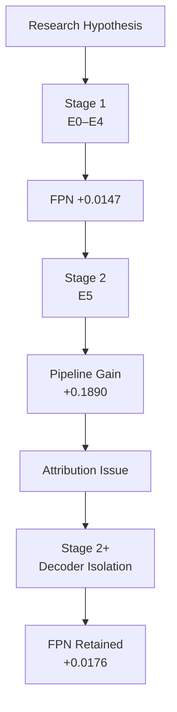

# SegFormer-B0 Semantic Segmentation Research Project

**Decoder 구조 변경은 lightweight encoder의 한계를 완화할 수 있는가?**

> 본 프로젝트는 SegFormer-B0에서 decoder 구조(FPN)의 실제 기여를  
> **controlled experiment**와 **decoder isolation** 기반으로 분석한 연구 프로젝트입니다.

---

## Experimental Flow



---

## 핵심 결과 요약

| 실험 | 목적 | 결과 |
|---|---|---|
| Stage 1 | decoder/loss 단일 변수 비교 | FPN +0.0147 mIoU |
| Stage 2 | 성능 향상 요소 조합 | E5 +0.1890 mIoU |
| Stage 2+ | decoder 효과 분리 검증 | FPN +0.0176 mIoU |
| 주요 분석 | class-wise / failure case 분석 | small/thin object 중심 개선 |
| 핵심 고민 | attribution limitation | decoder isolation 실험 추가 설계 |

---

# 1. Overview

본 프로젝트는 SegFormer-B0를 기반으로,  
lightweight encoder 환경에서 decoder 구조 변경이  
segmentation 성능에 미치는 영향을 분석한 연구입니다.

저희 연구는 SegFormer 논문의 model size ablation에서 출발했습니다.

SegFormer는 동일한 lightweight All-MLP decoder를 사용하면서도  
MiT-B0부터 MiT-B5까지 encoder scale에 따라 mIoU 차이가 크게 발생합니다.

<p align="center">
  
</p>

> **Reference from SegFormer paper**  
> MiT encoder scale에 따라 segmentation 성능 차이가 발생했습니다.

이 결과에서 다음과 같은 연구 가설을 세웠습니다.

> **encoder capacity가 제한된 SegFormer-B0에서는  
> decoder 단계의 multi-scale feature fusion이 더 중요한 역할을 할 수 있다.**

Reference :

- **SegFormer : Simple and Efficient Design for Semantic Segmentation with Transformers**
- https://arxiv.org/abs/2105.15203

본 프로젝트에서는 단순 성능 향상보다,  
**“왜 성능이 좋아졌는가?”를 검증하기 위한 controlled experiment와 decoder isolation 분석에 집중했습니다.**

---

# 2. Team / Role

### 전민지 — PM · Research · Implementation

<details>
<summary>Details</summary>

- Stage 1 실험 구현 및 분석
- FPN / MLP decoder 구현
- YAML 기반 experiment config 관리 구조 구현
- GitHub repository organization 및 Notion 관리

</details>

---

### 백찬호 — Research · Experimentation

<details>
<summary>Details</summary>

- Stage 2 실험 구현 및 분석
- Stage 2+ 실험 구현 및 분석
- Encoder 모듈화 구조 구현

</details>

---

### Shared Contributions

<details>
<summary>Details</summary>

- 연구 질문 및 실험 전략 설계
- metric / visualization pipeline 구현
- controlled experiment 환경 구성
- 실험 결과 정리, 비교, 검증 및 해석

</details>

---

# 3. Motivation

## SegFormer-B0 Limitation 가설

- encoder scale에 따른 큰 mIoU 차이
- lightweight MLP decoder 구조
- 제한적인 multi-scale interaction 가능성

본 프로젝트에서는 다음 가설을 세웠습니다.

> lightweight encoder 환경에서는  
> decoder 단계의 feature fusion 구조가 segmentation quality에 더 큰 영향을 줄 수 있다.

또한 본 연구는 단순 성능 향상이 아니라,

- decoder 구조 자체의 효과가 존재하는가
- validation improvement가 실제 generalization으로 이어지는가
- combined experiment에서 어떤 요소가 실제 improvement에 기여했는가

를 검증하는 방향에 집중했습니다.

---

# 4. Research Goal

| Goal | Question | Scope |
|---|---|---|
| G1 | Decoder 구조 변경(FPN)이 lightweight encoder의 한계를 완화할 수 있는가? | 본 repo |
| G2 | Loss function 조합이 segmentation 성능과 generalization에 어떤 영향을 주는가? | 본 repo |
| G3 | 제안한 pipeline이 medical segmentation domain에도 적용 가능한가? | 별도 repo |

현재 repo에서는 G1, G2를 중심으로 다룹니다.

G3는 Kvasir-SEG 기반 아래의 medical segmentation project에서 확인할 수 있습니다.

- https://github.com/iNES-Segmentation-Project/medical-seg-core

---

# 5. Experimental Design

## Core Principles

### Encoder 고정

<details>
<summary>Details</summary>

- MiT-B0 구조 유지
- encoder 기능 변경 금지
- 실험 재사용성을 위한 encoder 모듈화만 수행
- 추가 연산 또는 구조적 변경 없음

</details>

---

### Single-variable Principle

<details>
<summary>Details</summary>

- E0~E4는 decoder 또는 loss 중 하나만 변경
- 동일 학습 조건 유지
- 변수별 영향 분리

</details>

---

### Fair Comparison

<details>
<summary>Details</summary>

- 동일 dataset
- 동일 epoch
- 동일 augmentation 조건
- 동일 metric 기준

</details>

---

### E5 Combined Experiment

E0~E4 결과를 기반으로 성능 향상 가능성이 높은 요소를 조합했습니다.

<details>
<summary>Applied Components</summary>

- FPN decoder
- CE + Dice + Boundary loss
- pretrained encoder
- diff-LR
- augmentation
- warmup scheduler

> diff-LR은 pretrained encoder와 새로 학습되는 decoder의 학습 속도를 분리하기 위한 설정입니다.  
> encoder representation을 과도하게 깨뜨리지 않으면서 decoder 학습을 안정화하는 목적입니다.

</details>

---

# 6. Stage 1 — Controlled Experiment

## Setup

Stage 1에서는  
decoder 또는 loss 중 하나만 변경하는 controlled experiment를 수행했습니다.

| Exp | Decoder | Loss | Changed Variable |
|---|---|---|---|
| E0 | MLP | CE | Baseline |
| E1 | FPN | CE | Decoder |
| E2 | MLP | Focal | Loss |
| E3 | MLP | CE + Dice | Loss |
| E4 | MLP | CE + Boundary | Loss |

---

## Figure


> Stage 1의 E0–E4 단일 변수 실험 결과입니다.  
> E1(FPN)은 Pole, SignSymbol, Pedestrian 등 weak small/thin class에서 비교적 일관된 improvement를 보였습니다.  
> 반면 loss-based experiments(E2–E4)는 class-wise gain이 불안정하게 나타났습니다.

---

## Result

| Exp | Main Change | Test mIoU | Δ |
|---|---|---:|---:|
| E0 | MLP + CE | 0.5682 | — |
| E1 | FPN Decoder | **0.5829** | **+0.0147** |
| E2 | Focal Loss | 0.5669 | -0.0013 |
| E3 | CE + Dice | **0.5796** | **+0.0114** |
| E4 | CE + Boundary | 0.5705 | +0.0023 |

---

## Interpretation

Stage 1의 핵심 관찰은 다음과 같습니다.

- FPN decoder(E1)는 small/thin class에서 비교적 일관된 improvement를 보였습니다.
- 반면 loss-based experiments(E2–E4)는 class-wise gain이 불안정하게 나타났습니다.

특히 Pole, SignSymbol, Pedestrian과 같은 class에서 improvement가 반복적으로 관찰되었습니다.

이는 lightweight encoder 환경에서 decoder 기반 multi-scale feature fusion이  
loss 변경보다 더 안정적인 improvement signal로 작동할 가능성을 시사했습니다.

이 결과는 이후 E5 combined experiment와 Stage 2+ decoder isolation 설계의 핵심 근거가 되었습니다.

---

# 7. Stage 2 — Combined Experiment (E5)

## Setup

Stage 1 결과를 기반으로 성능 향상 가능성이 높은 요소를 조합했습니다.

<details>
<summary>Applied Components</summary>

- FPN decoder
- CE + Dice + Boundary loss
- pretrained encoder
- diff-LR
- augmentation
- warmup scheduler

</details>

---

## Result


> E5 combined experiment에서 pipeline-level improvement가 관찰되었습니다.  
> weak small/thin object class 중심의 성능 향상이 확인되었습니다.

| Exp | Main Change | Test mIoU | Δ |
|---|---|---:|---:|
| E0 | MLP + CE | 0.5682 | — |
| E5 | Combined Pipeline | **0.7572** | **+0.1890** |

---

## Qualitative


> thin/small object boundary 영역에서 stronger activation pattern이 관찰되었습니다.  
> 이는 정량 결과를 보조하는 정성적 근거로 해석했습니다.

<details>
<summary>Qualitative Segmentation Comparison</summary>

### E0 Baseline


### E5 Combined Pipeline


> E5에서 small/thin object detail 개선이 관찰되었습니다.  
> 단, combined experiment 결과이므로 FPN 단독 효과로는 해석하지 않았습니다.

</details>

---

## Attribution Limitation

> ⚠️ **E5는 combined experiment입니다.**  
> 따라서 성능 향상을 특정 요소 하나의 효과로 직접 해석할 수 없습니다.

E5는 +0.1890 mIoU를 보였지만,  
여러 요소가 동시에 변경된 combined experiment였기 때문에  
FPN 단독 효과로 해석하지 않았습니다.

E5에서는

- FPN decoder
- pretrained encoder
- augmentation
- scheduler
- combined loss

가 동시에 변경되었습니다.

즉,

> "성능은 좋아졌지만, 무엇이 실제 improvement에 기여했는지는 아직 분리되지 않았다"

는 attribution limitation이 발생했습니다.

이를 해결하기 위해  
Stage 2+ decoder isolation experiment를 추가 설계했습니다.

---

# 8. Stage 2+ — Decoder Isolation

## Why Stage 2+ Matters

E5는 strong improvement를 보였지만,  
combined experiment였기 때문에 decoder 단독 효과를 직접 해석할 수 없었습니다.

이를 보완하기 위해,  
본 프로젝트에서는 decoder만 변경하는 isolation experiment(Stage 2+)를 추가 설계했습니다.

핵심 목적은 다음이었습니다:

> “성능이 좋아졌는가?”가 아니라,  
> “무엇이 실제 improvement에 기여했는가?”를 검증하는 것

---

## Isolation Design

E5 attribution issue를 보완하기 위해  
Stage 2+에서는 decoder만 변경했습니다.

<details>
<summary>Fixed Conditions</summary>

- pretrained encoder
- CE loss
- scheduler
- augmentation
- train/val/test split

</details>

---

## Result

| Setting | Decoder | Test mIoU | Δ |
|---|---|---:|---:|
| Baseline | MLP | 0.7314 | — |
| FPN | FPN | **0.7490** | **+0.0176** |

| Condition | MLP → FPN Δ |
|---|---:|
| Scratch (E0 → E1) | +0.0147 |
| Pretrained (Stage 2+) | +0.0176 |

> training condition 변화와 무관하게 FPN improvement가 재현되었습니다.  
> 이는 decoder 구조 자체의 기여 가능성을 보여주는 결과로 해석했습니다.

---

## Class-wise Analysis

<p align="center">
  
</p>

<details>
<summary>Raw Class-wise Scores</summary>

| Class | MLP | FPN | Δ |
|---|---:|---:|---:|
| Pole | 0.4076 | **0.4672** | **+0.0596** |
| SignSymbol | 0.4646 | **0.5106** | **+0.0460** |
| Pedestrian | 0.5453 | **0.5791** | **+0.0338** |
| Pavement | 0.8483 | **0.8679** | +0.0196 |
| Car | 0.8531 | **0.8695** | +0.0164 |
| Bicyclist | **0.6425** | 0.6222 | **-0.0203** |

</details>

### 구조적 해석

Stage 2+ 결과에서

- Pole
- SignSymbol
- Pedestrian

같은 class에서 improvement가 집중적으로 나타났습니다.

이는 FPN decoder의 multi-scale feature fusion과 top-down semantic propagation이  
high-resolution feature의 semantic consistency를 보완했을 가능성과 연결됩니다.

특히 shallow feature에서 부족할 수 있는 semantic context를  
deep feature로 보완하면서

- small object continuity
- thin boundary preservation

에 도움을 주었을 가능성이 있습니다.

---

## Failure Case Analysis

FPN decoder는 대부분의 small/thin class에서 improvement를 보였지만,  
Bicyclist class에서는 오히려 성능이 감소했습니다.

| Class | MLP | FPN | Δ |
|---|---:|---:|---:|
| Bicyclist | **0.6425** | 0.6222 | **-0.0203** |

이 결과는

- FPN feature fusion이 모든 class에 동일하게 유리하지 않을 수 있으며,
- 특정 object structure 또는 class distribution에서는
  negative interaction이 발생할 가능성

을 시사합니다.

> FPN decoder의 효과는 universal improvement라기보다  
> 특정 object characteristic에 더 strongly connected된 현상으로 해석했습니다.

---

## Qualitative

<details>
<summary>Validation/Test Discrepancy</summary>


> E2(Focal Loss)에서 validation/test discrepancy가 관찰되었습니다.  
> validation score만으로는 loss 효과를 판단하기 어렵다는 점을 확인했습니다.

</details>

---

## Interpretation

Stage 2+ 결과는

- scratch(E0→E1)
- pretrained(Stage 2+)

양쪽 조건 모두에서 FPN improvement가 유지되었다는 점을 보여주었습니다.

> E5 improvement가 단순 pretrained effect만으로 설명되기 어렵고,  
> decoder 구조 자체의 기여 가능성도 존재한다는 근거로 해석했습니다.

특히 본 프로젝트에서 중요한 점은

> combined experiment의 한계를 그대로 인정하고,  
> decoder isolation experiment를 통해 attribution을 추가 검증하려 했다는 점입니다.

---

# 9. Implementation Highlights

- SegFormer encoder/decoder modularization
- FPN / MLP decoder 구현
- YAML 기반 experiment config 관리
- decoder isolation experiment 구조 구현
- HuggingFace pretrained weight remapping
- metric / visualization pipeline 구현

<details>
<summary>Implementation Details</summary>

### Encoder Modularization

- MiT-B0 구조 유지
- encoder 기능 변경 없음
- 실험 재사용성을 위한 모듈화
- decoder 교체 가능 구조 구성

### Decoder Implementation

MLP decoder

- feature projection
- upsampling
- concatenation
- fusion conv

FPN decoder

- lateral connection
- top-down pathway
- multi-scale feature fusion
- semantic propagation

### YAML Config Pipeline

- model type
- decoder type
- loss type
- pretrained 여부
- augmentation
- scheduler
- learning rate
- epoch

**config 변경만으로 E0~E5 및 Stage 2+ 실험을 재현할 수 있도록 구성했습니다.**

### Pretrained Weight Remapping

HuggingFace `mit-b0` weight를 custom MiTEncoder 구조에 맞게 remapping했습니다.

- state_dict key 변환
- key/value projection mapping
- pretrained encoder loading 지원

</details>

---

# 10. Overall Findings

- FPN decoder는 lightweight encoder 환경에서 일관된 improvement를 보였습니다.
- improvement는 특히 small/thin object에서 집중적으로 나타났습니다.
- E5 combined experiment만으로는 improvement attribution이 어렵다는 점을 확인했습니다.
- Stage 2+ decoder isolation을 통해 FPN effect를 추가 검증했습니다.
- Bicyclist failure case를 통해 FPN effect가 universal하지 않을 가능성도 확인했습니다.

---

# 11. Limitations

- E5는 combined experiment이므로 individual attribution에 한계가 존재했습니다.
- Stage 2+에서도 FPN 구조 효과와 parameter 증가 효과를 완전히 분리하기는 어려웠습니다.
- multi-seed statistical validation은 수행하지 못했습니다.
- 일부 class(Bicyclist)에서는 FPN 성능 감소가 관찰되었습니다.
- FPN decoder는 GFLOPs 증가에 따른 trade-off가 존재했습니다.
- CamVid는 SegFormer 논문의 CityScapes 대비 dataset 규모가 작기 때문에 statistical diversity 측면의 한계가 존재했습니다.

---

## Run Example

```bash
python scripts/train.py --config configs/e0_paperlike.yaml
```

---

## Tech Stack

- Python
- PyTorch
- OpenCV
- NumPy
- Matplotlib
- Albumentations
- Semantic Segmentation
- Computer Vision
